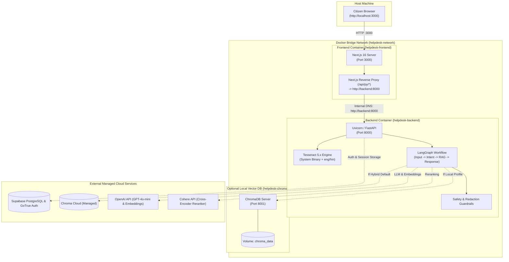

# Technical Specification: Containerization & Docker Topology

## 1. Executive Summary & Core Objectives

### 1.1 Purpose
The **Government Document Helpdesk** is a multi-tier AI system consisting of an asynchronous FastAPI backend (running LangGraph, OCR image/PDF parsing, hybrid RAG, and safety guardrails), a Next.js 16 frontend (with SSR, Google OAuth, and Supabase auth), and external vector/relational databases.

Currently, running the system locally requires manual orchestration across separate terminal sessions:
1. Native Windows Python virtual environment requiring local system binaries (`tesseract-ocr`).
2. Node.js runtime for Next.js (`npm run dev`).

### 1.2 Objectives
This specification defines the containerization strategy for the project. It provides:
1. **Zero-Setup Portability**: Package complex system binaries (Tesseract OCR, Poppler, C++ libraries) directly into Linux containers, eliminating host-OS installation requirements.
2. **Clean 2-Service Core Stack**: Focused strictly on the core application services: **Backend** (FastAPI) and **Frontend** (Next.js 16).
3. **Modular Architecture Options**: Profiles for **Standard Hybrid Cloud** (Chroma/Supabase SaaS), **100% Self-Hosted Local** (Local ChromaDB), and **Development Mode** (live code hot-reloading).
4. **Internal Reverse Proxying**: Dynamic internal routing (`INTERNAL_API_URL=http://backend:8000`) preventing container isolation issues across Docker bridge networks.

---

## 2. Container Topology & Architecture



---

## 3. Architecture Options Matrix

The Docker specification supports 3 deployment options:

| Profile Option | Best Suited For | Backend | Frontend | Vector Database | Auth / Database |
| :--- | :--- | :--- | :--- | :--- | :--- |
| **Option 1: Hybrid Cloud** *(Default)* | Current project setup | Containerized FastAPI + Tesseract | Containerized Next.js 16 | Managed Chroma Cloud | Managed Supabase Cloud |
| **Option 2: 100% Full Local** | Offline / Air-gapped / Local-only environments | Containerized FastAPI + Tesseract | Containerized Next.js 16 | Containerized ChromaDB (`chroma:8001`) | Managed or Local Supabase |
| **Option 3: Development Mode** | Rapid local feature iteration with live code sync | FastAPI (`--reload` + Volume Bind Mount) | Next.js (Turbopack + Volume Bind Mount) | Chroma Cloud or Local | Managed Supabase |

---

## 4. Container Specifications & Dockerfiles

### 4.1 Backend Service (`Dockerfile`)

The backend container packages Python 3.11 with Linux C-libraries for PDF rendering (`poppler`), image manipulation (`libgl1`, `libglib2.0`), and optical character recognition (`tesseract-ocr`).

```dockerfile
# Root: Dockerfile
FROM python:3.11-slim AS base

# 1. Environment configuration
ENV PYTHONDONTWRITEBYTECODE=1 \
    PYTHONUNBUFFERED=1 \
    DEBIAN_FRONTEND=noninteractive \
    TESSDATA_PREFIX=/usr/share/tesseract-ocr/5/tessdata/

# 2. Install essential system dependencies and OCR libraries
RUN apt-get update && apt-get install -y --no-install-recommends \
    tesseract-ocr \
    tesseract-ocr-eng \
    tesseract-ocr-hin \
    poppler-utils \
    libgl1 \
    libglib2.0-0 \
    curl \
    && rm -rf /var/lib/apt/lists/*

WORKDIR /app

# 3. Cache Python dependencies in separate layer
COPY requirements.txt .
RUN pip install --no-cache-dir --upgrade pip && \
    pip install --no-cache-dir -r requirements.txt

# 4. Copy application source code
COPY app/ ./app/
COPY guardrails/ ./guardrails/

# 5. Create non-root user for security compliance
RUN useradd -m -u 1001 helpdesk && \
    chown -R helpdesk:helpdesk /app
USER helpdesk

EXPOSE 8000

# 6. Healthcheck endpoint
HEALTHCHECK --interval=30s --timeout=5s --start-period=10s --retries=3 \
    CMD curl -f http://localhost:8000/docs || exit 1

# 7. Start Uvicorn bound to 0.0.0.0
CMD ["uvicorn", "app.api.main:app", "--host", "0.0.0.0", "--port", "8000"]
```

---

### 4.2 Frontend Service (`frontend/Dockerfile`)

Next.js 16 multi-stage build to minimize the final image size and isolate build-time dependencies:

```dockerfile
# frontend/Dockerfile
# ---------------------------------------------------------------------------
# Stage 1: Install Dependencies
# ---------------------------------------------------------------------------
FROM node:20-alpine AS deps
WORKDIR /app
RUN apk add --no-cache libc6-compat
COPY package.json package-lock.json ./
RUN npm ci

# ---------------------------------------------------------------------------
# Stage 2: Build Application
# ---------------------------------------------------------------------------
FROM node:20-alpine AS builder
WORKDIR /app
COPY --from=deps /app/node_modules ./node_modules
COPY . .

# Build arguments for public client environment variables
ARG NEXT_PUBLIC_SUPABASE_URL
ARG NEXT_PUBLIC_SUPABASE_ANON_KEY
ARG NEXT_PUBLIC_API_URL

ENV NEXT_PUBLIC_SUPABASE_URL=$NEXT_PUBLIC_SUPABASE_URL \
    NEXT_PUBLIC_SUPABASE_ANON_KEY=$NEXT_PUBLIC_SUPABASE_ANON_KEY \
    NEXT_PUBLIC_API_URL=$NEXT_PUBLIC_API_URL \
    NODE_ENV=production

RUN npm run build

# ---------------------------------------------------------------------------
# Stage 3: Production Runner
# ---------------------------------------------------------------------------
FROM node:20-alpine AS runner
WORKDIR /app

ENV NODE_ENV=production \
    PORT=3000 \
    HOSTNAME="0.0.0.0"

RUN addgroup --system --gid 1001 nodejs && \
    adduser --system --uid 1001 nextjs

# Copy static assets and built distribution
COPY --from=builder /app/public ./public
COPY --from=builder /app/.next ./.next
COPY --from=builder /app/node_modules ./node_modules
COPY --from=builder /app/package.json ./package.json
COPY --from=builder /app/next.config.ts ./next.config.ts

USER nextjs

EXPOSE 3000

HEALTHCHECK --interval=30s --timeout=5s --start-period=10s --retries=3 \
    CMD wget --no-verbose --tries=1 --spider http://localhost:3000/ || exit 1

CMD ["npm", "start"]
```

---

### 4.3 Frontend Development Container (`frontend/Dockerfile.dev`)

For active frontend code editing without rebuilding images on every save:

```dockerfile
# frontend/Dockerfile.dev
FROM node:20-alpine
WORKDIR /app
RUN apk add --no-cache libc6-compat
COPY package.json package-lock.json ./
RUN npm ci
COPY . .
EXPOSE 3000
CMD ["npm", "run", "dev"]
```

---

## 5. Master Docker Compose Orchestration (`docker-compose.yml`)

The root `docker-compose.yml` configures the core Backend and Frontend services with an optional profile for local ChromaDB:

```yaml
version: '3.8'

networks:
  helpdesk-network:
    driver: bridge

volumes:
  chroma_data:
    driver: local

services:
  # =========================================================================
  # 1. FastAPI Backend Service
  # =========================================================================
  backend:
    build:
      context: .
      dockerfile: Dockerfile
    container_name: helpdesk-backend
    restart: unless-stopped
    env_file:
      - .env
    ports:
      - "8000:8000"
    networks:
      - helpdesk-network

  # =========================================================================
  # 2. Next.js Frontend Service
  # =========================================================================
  frontend:
    build:
      context: ./frontend
      dockerfile: Dockerfile
      args:
        NEXT_PUBLIC_SUPABASE_URL: ${NEXT_PUBLIC_SUPABASE_URL}
        NEXT_PUBLIC_SUPABASE_ANON_KEY: ${NEXT_PUBLIC_SUPABASE_ANON_KEY}
    container_name: helpdesk-frontend
    restart: unless-stopped
    environment:
      - INTERNAL_API_URL=http://backend:8000
    ports:
      - "3000:3000"
    depends_on:
      - backend
    networks:
      - helpdesk-network

  # =========================================================================
  # 3. Optional: Local ChromaDB Vector Store (Profile: full-local)
  # =========================================================================
  chromadb:
    image: chromadb/chroma:0.5.5
    container_name: helpdesk-chroma
    restart: unless-stopped
    profiles:
      - full-local
    ports:
      - "8001:8000"
    volumes:
      - chroma_data:/chroma/chroma
    environment:
      - IS_PERSISTENT=TRUE
      - PERSIST_DIRECTORY=/chroma/chroma
    networks:
      - helpdesk-network
```

---

## 6. Networking & Ingress Resolution

### 6.1 The Container Isolation Challenge
Inside Docker, `127.0.0.1` and `localhost` resolve strictly to the **isolated container itself**. 
- The frontend container cannot proxy requests to `http://localhost:8000` because the backend runs in a separate container.
- When accessed via browser, requests to `/api/py/chat` hit Next.js on port 3000. Next.js must proxy that request to `http://backend:8000` using Docker's internal DNS.

### 6.2 Solution: Parameterized Next.js Proxy Rewrite
In [`frontend/next.config.ts`](file:///C:/Users/AdarshShrikrishnaNai/Desktop/government-document-helpdesk/frontend/next.config.ts):

```typescript
import type { NextConfig } from "next";

// On host machine defaults to 127.0.0.1; in Docker Compose uses http://backend:8000
const INTERNAL_API_URL = process.env.INTERNAL_API_URL || "http://127.0.0.1:8000";

const nextConfig: NextConfig = {
  async rewrites() {
    return [
      {
        source: "/api/py/:path*",
        destination: `${INTERNAL_API_URL}/:path*`,
      },
    ];
  },
};

export default nextConfig;
```

This single configuration ensures zero code changes whether running bare-metal on your host machine or inside Docker Compose.

---

## 7. Storage, Volumes & Persistence Matrix

| Volume Name | Container Path | Purpose | Backup Strategy |
| :--- | :--- | :--- | :--- |
| `chroma_data` | `/chroma/chroma` | (Full-local profile) Persists Chroma HNSW vector index files and metadata SQLite DB. | File-level directory copy when container is stopped. |
| `/tmp` (ephemeral) | `/tmp` | Staging area for temporary PDF page extraction and uploaded image OCR. | Auto-cleared by Linux tmpfs on container restart. |

---

## 8. Environment Variables & Secret Handling

A `.dockerignore` file prevents local credential and cache leaks:

```text
# .dockerignore
.venv/
__pycache__/
*.pyc
*.pyo
.git/
.env.local
node_modules/
.next/
chroma_db/
*.log
scratch/
```

### Required `.env` Keys for Container Launch:
```env
# OpenAI & Cohere LLM Services
OPENAI_API_KEY=sk-...
COHERE_API_KEY=...

# Supabase Auth & PostgreSQL
SUPABASE_URL=https://<project-id>.supabase.co
SUPABASE_ANON_KEY=eyJ...
SUPABASE_JWT_SECRET=...

# Chroma Vector Store (Hybrid Mode)
CHROMA_TENANT=...
CHROMA_DATABASE=...
CHROMA_API_KEY=...

# Langfuse Observability (Optional)
LANGFUSE_ENABLED=false
```

---

## 9. Operation & Deployment Runbook

### 9.1 Standard Startup (Default: Hybrid Cloud)
Builds and starts Backend and Frontend:
```bash
docker compose up --build -d
```

### 9.2 Full-Local Startup (Self-Hosted ChromaDB)
Starts all local services including self-hosted ChromaDB:
```bash
docker compose --profile full-local up --build -d
```

### 9.3 Development Mode with Live Code Sync
Using `docker-compose.override.yml` to bind-mount source code:
```bash
docker compose -f docker-compose.yml -f docker-compose.dev.yml up
```

### 9.4 Verifying Container Status & Health
```bash
# Check running containers and health statuses
docker compose ps

# View real-time logs across services
docker compose logs -f

# Run backend unit & integration tests inside Docker
docker compose exec backend pytest
```

### 9.5 Graceful Teardown
```bash
# Stop containers
docker compose down

# Wipe everything including volumes for clean slate
docker compose down -v
```

---

## 10. Verification & Test Plan

1. **OCR Verification Inside Container**:
   - Execute `docker compose exec backend tesseract --version` to ensure Tesseract 5.x is active.
   - Upload a sample Indian government ID image; verify OCR extracts text cleanly without `TesseractNotFoundError`.
2. **Internal Proxy & Rewrite Test**:
   - Send `POST http://localhost:3000/api/py/chat`; confirm Next.js proxies to `http://backend:8000/chat` and returns `200 OK`.
3. **Automated Test Suite**:
   - Run `docker compose exec backend pytest` to verify all 761 tests pass inside the Linux container environment.
