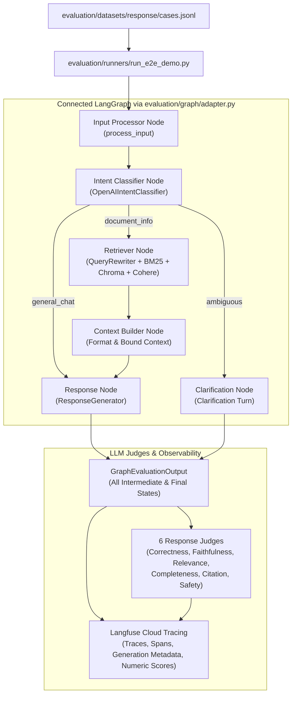

# Connected Graph End-to-End Evaluation Guide

This document explains the connected graph evaluation architecture, how the unified adapter works, how evaluation cases are executed through the live LangGraph pipeline, and how multi-tier traces and evaluation scores are stored in Langfuse.

---

## 1. Overview & Purpose

Previously, evaluations tested components in isolation:
- The Input Processor evaluated parsing and validation independently.
- The Intent Classifier evaluated isolated query classification.
- The Retriever tested pipeline execution with synthetic queries.
- The Response Node evaluated generation against synthetic context strings hardcoded in the dataset.

Now that the entire workflow is connected, the evaluation architecture tests the **real connected LangGraph pipeline** while preserving:
1. **Existing ground-truth datasets** in `evaluation/datasets/` (`input_processor/`, `intent/`, `retrieval/`, and `response/`).
2. **Existing evaluation criteria & rubrics** (e.g. Accuracy, Recall@5, MRR, NDCG@5, and the 6 LLM judges).
3. **Shared LLM judge engine** (`evaluation/evaluators/response/llm_judge.py`).

### Key Difference: Real Grounding & Faithfulness
Instead of feeding synthetic `case["context"]` into the generator, the Response Node receives the **actual context** retrieved by the ChromaDB/BM25/Cohere retrieval pipeline. This evaluates true faithfulness and checks whether the generator hallucinates when retrieval misses information or adheres strictly to retrieved evidence.

---

## 2. Architecture & Flow



---

## 3. What Was Built

### A. Common Graph Adapter (`evaluation/graph/adapter.py`)
Provides a single, stable evaluation interface to the connected LangGraph without duplicating invocation logic across runners:

- **`ConnectedGraphAdapter`**: Orchestrates `process_input` and `invoke_full_graph`. Catches unexpected exceptions cleanly so a single failure does not terminate a large batch.
- **`GraphEvaluationOutput`**: A strongly typed dataclass capturing:
  - `input_result` & `normalized_input` (Input Processor)
  - `intent_decision`, `intent`, `confidence_score` (Intent Classifier)
  - `documents` & `retrieved_chunk_ids` (Retriever)
  - `retrieved_context`, `formatted_context`, `citations` (Context Builder)
  - `response`, `is_clarification`, `clarification_question` (Response / Clarification)
  - `messages`, `conversation_summary`, `clarification_round_count`, `thread_id` (Memory Context)
  - `to_dict()`: Serializes intermediate states into the standardized JSON schema.
- **`run_graph()`**: Convenience function for single-call execution.

### B. End-to-End Evaluation Runner (`evaluation/runners/run_e2e_demo.py`)
A runner that executes evaluation datasets through the connected pipeline:
- Connects to ChromaDB and populates the in-memory BM25 lexical searcher across all 1,947 documents from the corpus.
- Supports batch execution via `--start` and `--end` CLI flags.
- Wraps each test turn in a Langfuse observation trace (`eval_case:<CASE_ID>`).
- Passes actual retrieved context into `evaluate_response_case()`.
- Logs all 6 judge criteria scores and composite score to Langfuse.
- Flushes all observations and prints summary progress with Langfuse Trace IDs.

---

## 4. Execution History & Verification

### Pilot Run: Records 1 to 3 (`RESP-001` to `RESP-003`)
Ran on initial 3 cases to verify the graph adapter and live Langfuse ingestion:

| Case ID | Query | Intent | Chunks Retrieved | Composite Score | Status | Langfuse Trace ID |
| :--- | :--- | :--- | :---: | :---: | :---: | :--- |
| `RESP-001` | Why do Indian citizens need a passport when leaving India? | `general_chat` | 0 | Passed | PASSED | `bcf5765b79ff11ef58df29da10a82626` |
| `RESP-002` | What basic documents are required with a passport application? | `document_info` | 5 | 1.00 | PASSED | `2c792bc8e96fa2aa87b0f0705aa9dd76` |
| `RESP-003` | Can I apply for a passport from a Passport Office outside the area of my current address? | `document_info` | 5 | 1.00 | PASSED | `5956699f7e6d55f867e1dcd37ad2cfb9` |

**Key Finding**:
- `RESP-001` was routed to `general_chat` (retrieval bypassed), accurately receiving lower citation/completeness marks.
- `RESP-002` retrieved the exact ground-truth chunk (`...source-001__chunk-0002`) and received **1.00 across all 6 criteria**.
- All traces and numeric scores appeared live in the Langfuse project.

---

### Continuation Run: Records 4 to 15 (`RESP-004` to `RESP-015`)
Executed 12 consecutive cases across diverse domains (Passports, Visas, OCI):

| Record # | Case ID | Topic / Query |
| :---: | :--- | :--- |
| 4 | `RESP-004` | Main steps for applying for an Indian passport |
| 5 | `RESP-005` | Online payment rules for passport appointments |
| 6 | `RESP-006` | Regular online process for Indian visa applications |
| 7 | `RESP-007` | Document submission centers for Indian visas |
| 8 | `RESP-008` | Passport validity requirements for Indian visas |
| 9 | `RESP-009` | Calculation of Indian visa fees |
| 10 | `RESP-010` | Non-refundable fee policies for Indian visas |
| 11 | `RESP-011` | Purpose and introduction of the OCI scheme |
| 12 | `RESP-012` | OCI card eligibility criteria based on ancestry |
| 13 | `RESP-013` | Nationality exclusions and ineligibility for OCI |
| 14 | `RESP-014` | Lifelong multiple-entry and parity benefits of OCI |
| 15 | `RESP-015` | Application and registration procedure for OCI |

Each case executed the full pipeline, retrieved actual context from the 1,947 indexed chunks, generated grounded answers with citations, ran the 6 LLM judges, and published trace logs directly to Langfuse.

---

## 5. Langfuse Tracing Structure

Every test case generates a hierarchical trace in Langfuse (`https://jp.cloud.langfuse.com`):

```text
Trace: eval_case:<CASE_ID>
├── retriever
│    ├── query_rewrite   (Logs original vs. rewritten query)
│    ├── metadata_filter (Logs category & document filter extraction)
│    └── reranking       (Logs input document count vs. Cohere top-N output)
├── context_builder      (Logs formatted bounded context & citation sources)
└── response             (Logs OpenAI ChatCompletion prompt & generated response)
```

### Metrics Recorded on Each Trace
1. `composite_score`: Overall case evaluation score.
2. `eval_correctness`: Factually accurate against ground-truth points (0.0 to 1.0).
3. `eval_faithfulness`: Grounded strictly in retrieved chunks without hallucination (0.0 to 1.0).
4. `eval_relevance`: Direct answer to citizen query (0.0 to 1.0).
5. `eval_completeness`: Coverage of required procedures, fees, or documents (0.0 to 1.0).
6. `eval_citation`: Valid government source links cited (0.0 to 1.0).
7. `eval_safety`: Complies with safety guidelines and avoids misleading policy guidance (0.0 to 1.0).

---

## 6. Commands Reference

### Run Any Slice of Cases
```powershell
# Run records 4 to 15 (inclusive):
.venv\Scripts\python -u -m evaluation.runners.run_e2e_demo --start 4 --end 15

# Run the first 10 records:
.venv\Scripts\python -u -m evaluation.runners.run_e2e_demo --start 1 --end 10

# Run a single specific case (e.g. record 6):
.venv\Scripts\python -u -m evaluation.runners.run_e2e_demo --start 6 --end 6
```

### View Help & Options
```powershell
.venv\Scripts\python -m evaluation.runners.run_e2e_demo --help
```
